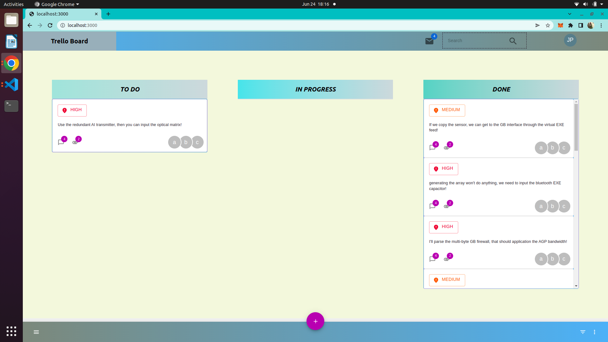
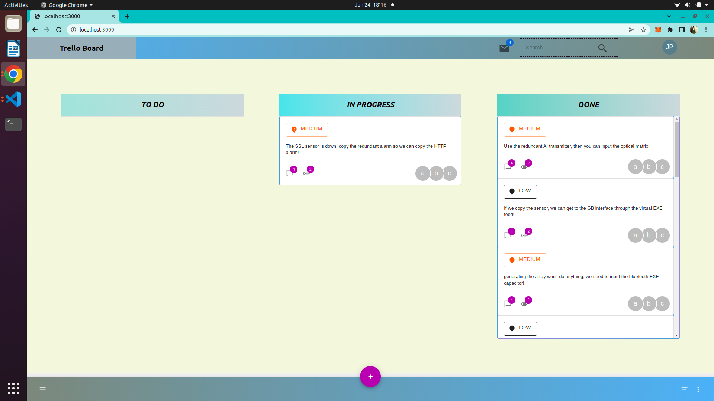

The idea of this task is building a very simple non-interactive Trello board that automatically updates while the web app is open.

We provide a basic setup and a functional first version of the desired web app in this repo. The web app consumes this GraphQL endpoint: [frontend.hiring.iodevnet.com/graphql](https://frontend.hiring.iodevnet.com/graphql), which takes care of generating new mock tasks and changing their status, so that you can focus solely on the UI.

## Goals of the task

### Real-time updates

1. Poll the backend every second or every few seconds **without** using Apollo’s `pollInterval`.
   
   > I have used startPolling(1000)
   
2. Store your tasks grouped by `status` in your own data structure or structures (e.g. three separate arrays).
  
   > I have restructure the data as shown below:
   > todoArr = [name, date, priority]
   > inProgressArr = [name, date, priority]
   > doneArr = [name, date, priority]
   
3. Use your structure created in the previous step to render the data.
   
   > Please refer to ./src/scenes/Index/index.tsx for the change.
  
   
### UI

1. Build a UI with 3 columns that looks a bit better than the one we provided.
   *Screen Shot1*
   *Screen Shot2*

2. Render the name of each task instead of its ID.
   
   > I have add "name" in the ./src/generated/graphql.tsx, JobsDocument which allowed me to pull the name of each task.
   
3. Each column should have its own separate scroll.
  
   > Please refer with the image above
  

## What will we be paying attention to?

1. Coding style and consistency.
2. CSS knowledge. Go ahead and impress us.
3. React lifecycle knowledge.
4. Performance considerations.

> Feel free to modify any of the existing code. 💁‍♀️

## Running this project

1. Install [pnpm](https://pnpm.io/) if you do not already have it.
2. Clone the repo.
3. Install all dependencies with:
   ```bash
   pnpm install
   ```
4. Run the project with:
   ```bash
   pnpm dev
   ```
